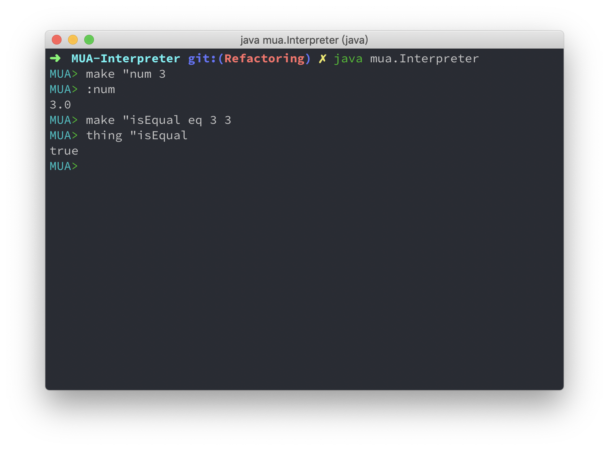

# MUA Interpreter

陈佳伟 3160102178

## 实现的功能

* 基本数据类型 `number` , `word` , `list` , `bool`  的创建与存储
* 注释 `//`
* `make <word> <value>`： 将value绑定到word上。基本操作的字不能用做这里的word。绑定后的word称作名字，位于命名空间。
* `thing <word>`：返回word所绑定的值
* `:<word>`：与thing相同
* `erase <word>`：清除word所绑定的值
* `isname <word>`：返回word是否是一个名字，true/false
* `print <value>`：输出value
* `read`：返回一个从标准输入读取的数字或字
* `readlist`：返回一个从标准输入读取的一行，构成一个表，行中每个以空格分隔的部分是list的一个元素
* 运算符operator
  - `add`, `sub`, `mul`, `div`, `mod`：`<operator> <number> <number>`
  - `eq`, `gt`, `lt`：`<operator> <number|word> <number|word>`
  - `and`, `or`：`<operator> <bool> <bool>`
  - `not`：`not <bool>`
* 退出命令 `exit`

## 运行方法


## 运行效果



## 实现方法

### 总设计

#### 类的协作关系


#### 类型系统


### 具体设计

#### InterpreterController

核心组件是 `InterpreterController` ，负责整个流程，主要流程如下：

```java
interpret() {
    initInterpreter()
    while (shouldContinue()) {
        readyForReadingInstruction()
        readInstruction() //use FrontEnd
        scanInstruction() //use Parser
        runOperations() //use Runner
        printMeaasge() //use FrontEnd
        clearAfterALoop()
    }
}
```

#### Lexer

`Lexer` 负责解析 `String instruction`，将其解析为 `List<MuaObject>` 以方便 `Runner` 去执行。

`Lexer` 的 `scan()` 函数流程大致如下：

```java
scan() {
    removeComment() //String -> String
    convertInstructionToTokenList() //String -> List<String>
    evaluateTokenListToObjectList() //List<String> -> List<MuaObject>
}
```

其中 `evaluateTokenListToObjectList()` 需要对每个 token 判断类型，从而转为 `MuaObject` ，这里使用了表驱动方法，避免了大量的 `if-else` 语句块，并且增加了可扩展性。

```
evaluateTokenListToObjectList() {
    for token in TokenList {
        for type in TypeArray {
            if (token belongs to type) {
                constructCorrespondingMuaObject()
            }
        }
    }
}
```

#### Runner

`Runner` 将 `List<MuaObject>` 对应的指令解析执行，并返回 `MuaObject` 结果。

```java
run() {
    while (objectListIterator.hasNext()) {
        evaluateCurrentObject()
        sendResultToControllerAndPrint()
    }
}
```

当 `evaluateCurrentObject()` 读取到一个函数对象 (比如 `make` 命令) 时，它会用 `objectListIterator.next()` 读取之后的若干个参数传入函数对象中处理。

## 测试样例示例

### 基本绑定赋值取值操作：

```
make "aList [make "anotherList ["word1 5 true]]
:aList
```

```
make "aWord "this_is_a_word
:aWord
```

```
make "num 3
thing "num
:num
isname "num
print :num
```

### 算术运算与布尔运算

```
add 3 4
sub 2 8
mul 7 9
div 4 3
mod 5 2
```

```
eq 7 7
eq "word1 "word1
eq "word1 "word2
eq "word1 "word10
gt 5 2
gt 3 4
lt 5 2
lt 3 4
```

```
not true
not false
and true false
and true true
or false false
or true false
```

### IO 操作

```
make "anotherNum read
7
:anotherNum
```

```
make "list3 readlist
make "anotherList ["word1 5 true]
:list3
```

### 其他

```
add 3 4 //this is a comment
```

```
exit
```


## 可改进的地方

* 错误处理
* 架构设计与解耦合
* 其他功能

