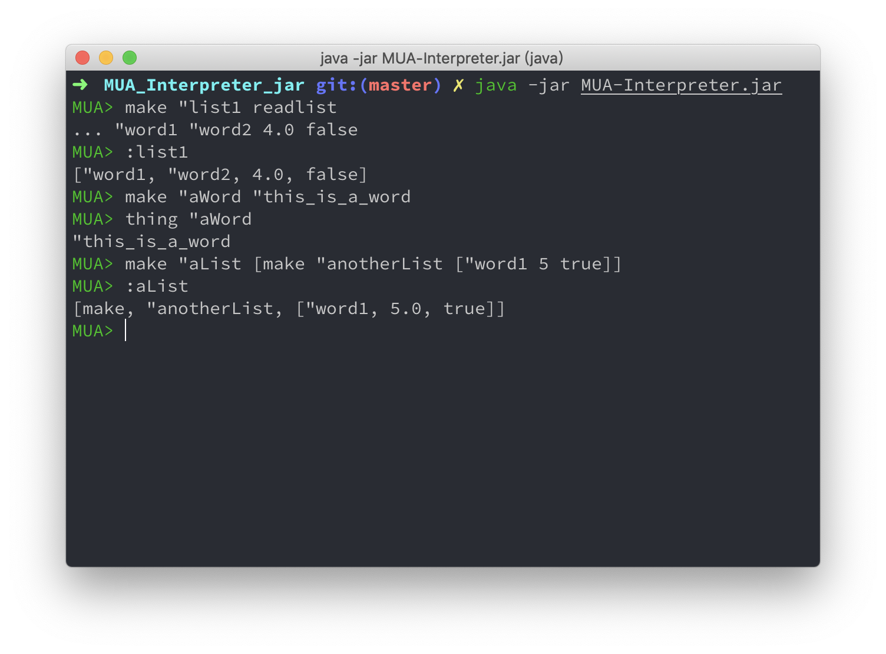
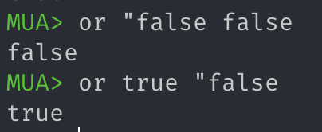
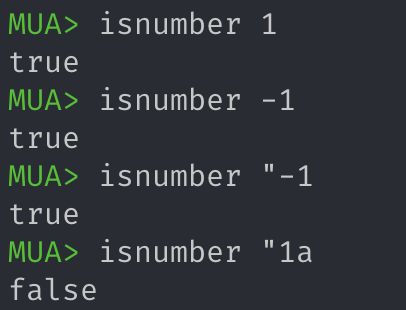

# MUA Interpreter

陈佳伟 

3160102178

3160102178@zju.edu.cn

## 运行效果



## 实现的功能

* 基本数据类型 `number` , `word` , `list` , `bool`  

* 注释 `//`

  示例：

  ```
  make "w "this_is_a_word //this is comment
  ```

* `make <word> <value>`： 将value绑定到word上。基本操作的字不能用做这里的word。绑定后的word称作名字，位于命名空间。

  示例：

  ```
  make "w "this_is_a_word
  ```

* `thing <word>`：返回word所绑定的值

  示例：

  ```
  thing "word //"word has been made before
  ```

* `:<word>`：与thing相同

  示例：

  ```
  :word //"word has been made before
  ```

  

* `erase <word>`：清除word所绑定的值

  示例：

  ```
  erase "w
  ```

  

* `isname <word>`：返回word是否是一个名字，true/false

  示例：

  ```
  isname "w //if "word has been erase, return false
  ```

  ```
  isname "thing //return true, because `thing` is a builtin operator
  ```

  

* `print <value>`：输出value

  示例：

  ```
  print "w //will print "word
  ```

  ```
  print :w //will print the value "word reference to, if it reference one
  ```

  

* `read`：返回一个从标准输入读取的数字或字

  示例：

  ```
  make "this_is_a_number read //这里要回车
  1 //这里要回车
  ```

  

* `readlist`：返回一个从标准输入读取的一行，构成一个表，行中每个以空格分隔的部分是list的一个元素

  示例：

  ```
  make "this_is_a_list readlist //这里要回车
  1 2 "word1 make "word2 "word3 //这里要回车
  ```

  

* 运算符operator

  - `add`, `sub`, `mul`, `div`, `mod`：`<operator> <number> <number>`

    

    

  - `eq`, `gt`, `lt`：`<operator> <number|word> <number|word>`

    

    

  - `and`, `or`：`<operator> <bool> <bool>`

    

    

  - `not`：`not <bool>`

    

* 退出命令 `exit`

* `repeat <number> <list>`：运行list中的代码number次

  

* 函数定义与调用

  ```
  	make <word> [<list1> <list2>]
  		word为函数名
  		list1为参数表
  		list2为操作表
  	<functionName> <arglist>
  		<functionName>为make中定义的函数名，不需要双引号"
  		<arglist>是参数表，<arglist>中的值和函数定义时的<list1>中名字进行一一对应绑定
  ```

  

* `output <value>`：设定value为返回给调用者的值，但是不停止执行

* `stop`：停止执行

  `stop` 可以停止函数以及 `repeat` 和 `run` 指令

  ```java
  //pseudocode
  i = 0;
  repeat 10 {
      i = i + 1
      print(i)
      if (i > 5) {
          print("stop)
          stop
      }
  }
  ```

  

* `export`：将本地make的值输出到全局

  

* `isnumber <value>`：返回value是否是数字 

  

* `isword <value>`：返回value是否是字

  

* `islist <value>`：返回value是否是表 

  

* `isbool <value>`：返回value是否是布尔量 

  

* `isempty <word|list>`: 返回word或list是否是空

  

* `random <number>`：返回[0,number)的一个随机数

  

* `sqrt <number>`：返回number的平方根

  

* `int <number>`: floor the int


- `word <word> <word|number|bool>`：将两个word合并为一个word，第二个值可以是word、number或bool
- `if <bool> <list1> <list2>`：如果bool为真，则执行list1，否则执行list2。list均可以为空表
- `sentence <value1> <value2>`：将value1和value2合并成一个表，两个值的元素并列，value1的在value2的前面
- `list <value1> <value2>`：将两个值合并为一个表，如果值为表，则不打开这个表
- `join <list> <value>`：将value作为list的最后一个元素加入到list中（如果value是表，则整个value成为表的最后一个元素）
- `first <word|list>`：返回word的第一个字符，或list的第一个元素
- `last <word|list>`：返回word的最后一个字符，list的最后一个元素
- `butfirst <word|list>`：返回除第一个元素外剩下的表，或除第一个字符外剩下的字
- `butlast <word|list>`：返回除最后一个元素外剩下的表，或除最后一个字符外剩下的字

*  `butlast <word|list>`：返回除最后一个元素外剩下的表，或除最后一个字符外剩下的字

- `wait <number>`：等待number个ms
- `save <word>`：保存当前命名空间在word文件中
- `load <word>`：从word文件中装载内容，加入当前命名空间
- `erall`：清除当前命名空间的全部内容
- `poall`：列出当前命名空间的全部名字

- `pi`：3.14159
- `run <list>`：运行list中的代码