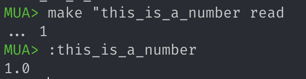
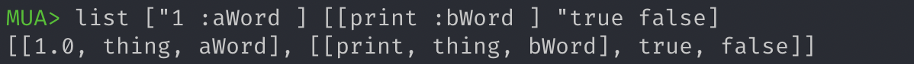

# MUA Interpreter


## 运行效果


## 运行方法

可在浙大云盘 https://pan.zju.edu.cn/share/357a1f949dde5f563fde8eb0d3 下载 `JAR` 文件

```shell
java -jar MUA-Interpreter.jar
```

## 实现的功能

* 基本数据类型 `number` , `word` , `list` , `bool`  

* 注释 `//`

  示例：

  ```
  make "w "this_is_a_word //this is comment
  ```

* `make <word> <value>`： 将value绑定到word上。基本操作的字不能用做这里的word。绑定后的word称作名字，位于命名空间。

  示例：

  ```
  make "w "this_is_a_word
  ```

* `thing <word>`：返回word所绑定的值

  示例：

  ```
  thing "word //"word has been made before
  ```

* `:<word>`：与thing相同

  示例：

  ```
  :word //"word has been made before
  ```

  

* `erase <word>`：清除word所绑定的值

  示例：

  ```
  erase "w
  ```

  

* `isname <word>`：返回word是否是一个名字，true/false

  示例：

  ```
  isname "w //if "word has been erase, return false
  ```

  ```
  isname "thing //return true, because `thing` is a builtin operator
  ```

  

* `print <value>`：输出value

  示例：

  ```
  print "w //will print "word
  ```

  ```
  print :w //will print the value "word reference to, if it reference one
  ```

  

* `read`：返回一个从标准输入读取的数字或字

  示例：

  ```
  make "this_is_a_number read //这里要回车
  1 //这里要回车
  ```

  

* `readlist`：返回一个从标准输入读取的一行，构成一个表，行中每个以空格分隔的部分是list的一个元素

  示例：

  ```
  make "this_is_a_list readlist //这里要回车
  1 2 "word1 make "word2 "word3 //这里要回车
  ```

  

* 运算符operator

  - `add`, `sub`, `mul`, `div`, `mod`：`<operator> <number> <number>`

    

    

  - `eq`, `gt`, `lt`：`<operator> <number|word> <number|word>`

    

    

  - `and`, `or`：`<operator> <bool> <bool>`

    

    

  - `not`：`not <bool>`

    

* 退出命令 `exit`

* `repeat <number> <list>`：运行list中的代码number次

  

* 函数定义与调用

  **注意：函数的定义必须在一行内完成，否则解析器会认为该指令未完成**

  ```
  	make <word> [<list1> <list2>]
  		word为函数名
  		list1为参数表
  		list2为操作表
  	<functionName> <arglist>
  		<functionName>为make中定义的函数名，不需要双引号"
  		<arglist>是参数表，<arglist>中的值和函数定义时的<list1>中名字进行一一对应绑定
  ```

  

* `output <value>`：设定value为返回给调用者的值，但是不停止执行

* `stop`：停止执行

  `stop` 可以停止函数以及 `repeat` 和 `run` 指令

  ```java
  //pseudocode
  i = 0;
  repeat 10 {
      i = i + 1
      print(i)
      if (i > 5) {
          print("stop)
          stop
      }
  }
  ```

  

* `export`：将本地make的值输出到全局

  

* `isnumber <value>`：返回value是否是数字 

  

* `isword <value>`：返回value是否是字

  

* `islist <value>`：返回value是否是表 

  

* `isbool <value>`：返回value是否是布尔量 

  

* `isempty <word|list>`: 返回word或list是否是空

  

* `random <number>`：返回[0,number)的一个随机数

  

* `sqrt <number>`：返回number的平方根

  

* `int <number>`: floor the int


- `word <word> <word|number|bool>`：将两个word合并为一个word，第二个值可以是word、number或bool

  

- `if <bool> <list1> <list2>`：如果bool为真，则执行list1，否则执行list2。list均可以为空表

  

- `sentence <value1> <value2>`：将value1和value2合并成一个表，两个值的元素并列，value1的在value2的前面

  

- `list <value1> <value2>`：将两个值合并为一个表，如果值为表，则不打开这个表

  

- `join <list> <value>`：将value作为list的最后一个元素加入到list中（如果value是表，则整个value成为表的最后一个元素）

  

- `first <word|list>`：返回word的第一个字符，或list的第一个元素

  

- `last <word|list>`：返回word的最后一个字符，list的最后一个元素

  

- `butfirst <word|list>`：返回除第一个元素外剩下的表，或除第一个字符外剩下的字

  

- `butlast <word|list>`：返回除最后一个元素外剩下的表，或除最后一个字符外剩下的字

  

- `wait <number>`：等待number个ms
- `save <word>`：保存当前命名空间在word文件中

- `load <word>`：从word文件中装载内容，加入当前命名空间

- `erall`：清除当前命名空间的全部内容

- `poall`：列出当前命名空间的全部名字

  

- `pi`：3.14159

  

- `run <list>`：运行list中的代码

  


## 实现方法

### 总设计

#### 类的协作关系


#### 类型系统


所有对象的基类是 `MuaObject` ，由此派生出 `MuaPrimitiveType` 和 `MuaOperator` 类。

对于 `MuaOperator` 类，

```java
abstract class MuaOperator extends MuaObject {
    public abstract MuaObject operate(ArgumentList argumentList);
    public int getArgumentNum();
}
```

抽象方法 `operate()` 是使用该函数/算子进行处理的方法，通过向其中传入 `ArgumentList` 对象，可以实现传递参数。

### 具体设计

#### InterpreterController

核心组件是 `InterpreterController` ，负责整个流程，主要流程如下：

```java
interpret() {
    initInterpreter()
    while (shouldContinue()) {
        readyForReadingInstruction()
        readInstruction() //use FrontEnd
        scanInstruction() //use Parser
        runOperations() //use Runner
        printMeaasge() //use FrontEnd
        clearAfterALoop()
    }
}
```

#### Lexer

`Lexer` 负责解析 `String instruction`，将其解析为 `List<MuaObject>` 以方便 `Runner` 去执行。

`Lexer` 的 `scan()` 函数流程大致如下：

```java
scan() {
    removeComment() //String -> String
    convertInstructionToTokenList() //String -> List<String>
    evaluateTokenListToObjectList() //List<String> -> List<MuaObject>
}
```

其中 `evaluateTokenListToObjectList()` 需要对每个 token 判断类型，从而转为 `MuaObject` ，这里使用了表驱动方法，避免了大量的 `if-else` 语句块，并且增加了可扩展性。

```
evaluateTokenListToObjectList() {
    for token in TokenList {
        for type in TypeArray {
            if (token belongs to type) {
                constructCorrespondingMuaObject()
            }
        }
    }
}
```

#### Runner

`Runner` 将 `List<MuaObject>` 对应的指令解析执行，并返回 `MuaObject` 结果。

```java
run() {
    while (objectListIterator.hasNext()) {
        evaluateCurrentObject()
        sendResultToControllerAndPrint()
    }
}
```

当 `evaluateCurrentObject()` 读取到一个函数对象 (比如 `make` 命令) 时，它会用 `objectListIterator.next()` 读取之后的若干个参数传入函数对象中处理。

#### NamespaceStack

NamespaceStack中以堆栈的形式存储了不同的变量名空间：

```java
class NamespaceStack {
    static Stack<Namespace> namespaceStack;
    ...
}
```

栈中最顶层的 `Namespace` 元素即为当前上下文的所有可引用变量名，堆栈的最底层是 global 空间。

```java
class Namespace {
    Map<String, MuaObject> map;
    ...
}
```

`Namespace` 对象用 `HashMap` 来实现名字-对象映射。

没调用一个函数就会向栈中加一个 `namespace` ，来存储对应名字；当函数退出时，栈将顶层 `namespace` 弹出。


#### 函数调用和内置运算符调用

函数和内置运算符分别用类 `MuaFunction` 和 `MuaOperator` 作为基类，分别有 `run()` 和 `operator()` 方法作为调用。


#### `number` 和 `bool` 类型作为 `word` 的类型的特例

根据要求规定， `number` 和 `bool` 是 `word` 的特例，但是由于之前代码分开来写，所以为了不对代码做太大调整，没有让 `number` 和 `bool` 持有或继承 `word` ，而是在具体的 `isword` 、`isnumber` 等函数运行时才进行相互转换。


#### 关于延迟解析

本项目的基本原则是，能尽早解析今早解析，不能尽早解析的推迟至指令执行时解析。

例如，对于 `make "func [[f] [f "helloworld ]]` ，其中 `f` 无法在仅有这条语句的时候解析出来，那么我让 `lexer` 先将它解析为 `NonDeterministicObject` ，等到指令真正执行时再查找 `Namespace` 看看是否能具体解析出来。


#### 自定义函数的实现

当定义一个函数时，先不解析它的参数表，只是把参数当作 `NonDeterministicObject` ，等到调用时，将参数表中的参数与具体传进去的实参相联系，并存储在 `HashMap` 中。


## 主要遇到的问题与解决

* 多变的需求是本项目的主要难点，多变的需求要求良好的架构设计，模块之间充分解耦合，并且在事先要想好可能出现的变更。
* 刚开始设计的时候把解析命令字符串和运行命令放在一起做，但是后来发现这样做一是使得功能耦合，二是使得后续函数功能无法实现，因此后来改为分成两个模块来实现。